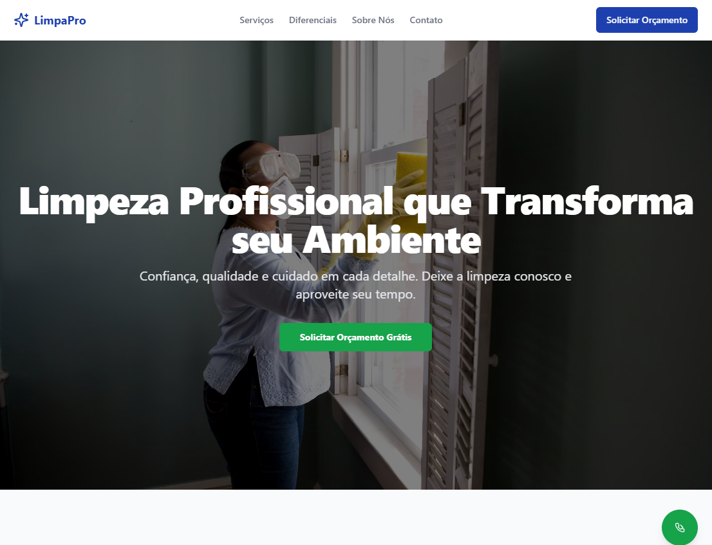
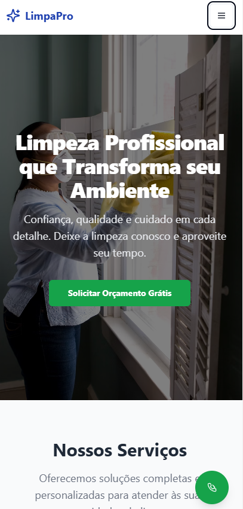
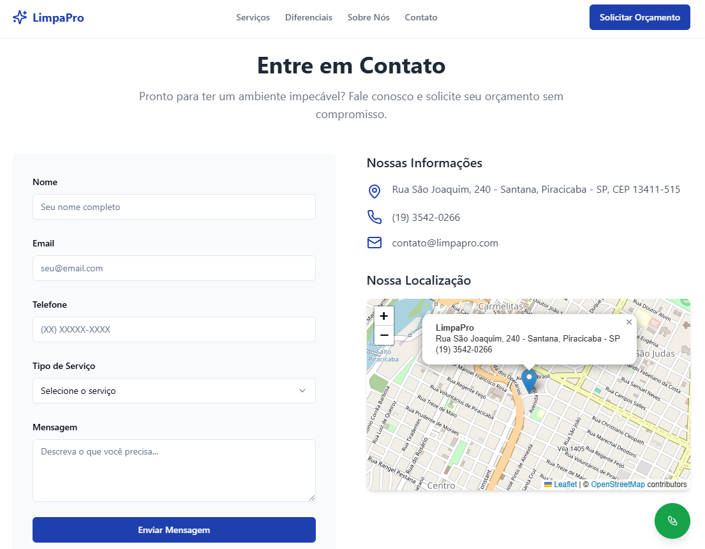
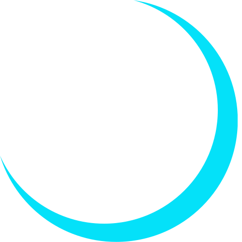

# LimpaPro - Site Institucional para Empresa de Limpeza

<div align="center">
  <svg width="80" height="80" viewBox="0 0 24 24" fill="none" xmlns="http://www.w3.org/2000/svg">
    <path d="M9.937 15.5A2 2 0 0 0 8.5 14.063l-6.135-1.582a.5.5 0 0 1 0-.962L8.5 9.936A2 2 0 0 0 9.937 8.5l1.582-6.135a.5.5 0 0 1 .963 0L14.063 8.5A2 2 0 0 0 15.5 9.937l6.135 1.581a.5.5 0 0 1 0 .964L15.5 14.063a2 2 0 0 0-1.437 1.437l-1.582 6.135a.5.5 0 0 1-.963 0z" fill="#0ea5e9"/>
  </svg>

  <h1>LimpaPro</h1>
  <h3>Site Institucional para Empresa de Limpeza Profissional</h3>

  <p>
    <a href="https://limpapro.vercel.app"><strong>🌐 Live Demo</strong></a> |
    <a href="#-sobre-o-autor"><strong>👨‍💻 Desenvolvedor</strong></a>
  </p>

  <p>
    
    
    
    
    
    
    
  </p>
</div>

---

O LimpaPro é um site institucional one-page, moderno e totalmente responsivo, desenvolvido para empresas de limpeza profissional. O projeto foi criado para transformar a presença digital do negócio, focando em gerar confiança, capturar leads qualificados e comunicar valor de forma clara e eficiente — com suporte a três idiomas, dark mode e animações cinematográficas.

---

## 1. O Desafio (Problema)

Empresas de pequeno e médio porte no setor de serviços, como limpeza profissional, frequentemente enfrentam dificuldades para estabelecer uma presença online que transmita profissionalismo e confiança. A ausência de um site otimizado resulta na perda de oportunidades de negócio e dificulta a competição em um mercado digital.

Os principais desafios a serem resolvidos eram:
- **Credibilidade:** Criar uma imagem digital que refletisse a qualidade e a confiabilidade dos serviços prestados.
- **Geração de Leads:** Implementar um canal direto e eficaz para que potenciais clientes pudessem solicitar orçamentos.
- **Acessibilidade:** Garantir uma experiência de usuário impecável em qualquer dispositivo, especialmente smartphones.
- **Internacionalização:** Suportar múltiplos idiomas para ampliar o alcance da marca.
- **Preferências do usuário:** Respeitar o tema (claro/escuro) e o idioma salvos entre sessões.

## 2. Minha Solução (Processo)

Para atender a esses requisitos, desenvolvi uma landing page completa utilizando uma stack moderna, uma metodologia de desenvolvimento ágil assistida por IA e um processo de modernização em 5 fases documentadas em [`/docs`](./docs/ROADMAP.md).

#### Stack Tecnológica e Justificativas:

- **React + Vite:** Robustez e ecossistema maduro para componentes reutilizáveis e interativos.
- **Tailwind CSS:** Desenvolvimento UI rápido, consistente e responsivo com `utility-first`.
- **react-i18next:** Internacionalização declarativa com detecção automática de idioma e fallback.
- **next-themes:** Dark/light mode sem flash (anti-FOUC), persistindo preferência via `localStorage`.
- **shadcn/ui + Radix UI:** Componentes acessíveis e estilizáveis como base de formulário e modais.
- **Leaflet.js:** Mapa interativo leve e open-source para exibir a localização da empresa.
- **TypeScript:** Segurança de tipos, melhor manutenibilidade e autocompletar.

#### Processo de desenvolvimento em 5 fases:

| Fase | Descrição | Status |
|------|-----------|--------|
| 1 | Infraestrutura i18n + Tema | ✅ Concluído |
| 2 | Header Moderno (toggle tema/idioma) | ✅ Concluído |
| 3 | Dark Mode em todos os componentes | ✅ Concluído |
| 4 | Internacionalização dos textos (PT-BR / EN / FR) | ✅ Concluído |
| 5 | Modernização Visual (tipografia, animações, UI) | ✅ Concluído |

## 3. Resultados e Impacto (Resultado)

O resultado final é um site institucional de alta performance, visualmente atraente e focado em conversão.

- **Multilíngue:** Suporte nativo a PT-BR, EN e FR com detecção automática do idioma do navegador.
- **Dark / Light Mode:** Alternância fluida com persistência entre sessões e sem flash de tema errado.
- **Animações cinematográficas:** Efeito Ken Burns no hero, scroll reveal direcional, progress bar e scroll-to-top.
- **Design system consistente:** Tipografia, espaçamento, cores e padrões documentados em `.interface-design/system.md`.
- **100% Responsivo:** Interface adaptada para desktop, tablet e smartphone.
- **Canais de conversão:** Formulário validado + botão flutuante de WhatsApp com mensagem pré-preenchida.
- **Deploy automatizado:** Vercel com CI/CD — novas versões publicadas a cada push.

## 4. Features Técnicas

### Interface e UX
- ✅ **Dark / Light Mode** — Alternância via `next-themes`, persistida em `localStorage`, sem flash (anti-FOUC via script inline no `<head>`)
- ✅ **Internacionalização (i18n)** — PT-BR, EN e FR com `react-i18next`; detecção automática do idioma do navegador; textos e arrays de itens traduzidos via JSON
- ✅ **Tipografia dual** — Inter (corpo/UI) + Plus Jakarta Sans (headings) via Google Fonts
- ✅ **Design Responsivo (Mobile-First)** — Layout otimizado para todos os tamanhos de tela
- ✅ **Header fixo moderno** — Com `backdrop-blur`, toggle de tema (Sol/Lua), seletor de idioma e menu drawer mobile

### Animações e Movimento
- ✅ **Ken Burns no Hero** — Slow zoom + leve deslocamento na imagem de fundo (20s, `infinite alternate`, GPU-accelerated)
- ✅ **Scroll Reveal direcional** — `AnimatedWrapper` com `IntersectionObserver` e suporte a `direction`: `up / left / right / fade`
- ✅ **Barra de progresso de scroll** — Fixada no topo, gradiente azul→verde, atualizada em tempo real
- ✅ **Botão "Voltar ao topo"** — Aparece após 400px de scroll, animado, posicionado acima do WhatsApp

### Seções e Componentes
- ✅ **Hero** — `min-h-screen`, badge, estatísticas (500+ clientes / 10+ anos / 100% satisfação), scroll indicator com `animate-bounce`
- ✅ **Services** — Cards com número de ordem, ícone em caixa arredondada, hover elevation, CTA "Saiba mais →"
- ✅ **WhyUs** — Features numeradas com círculos de ícone e `SectionBadge`
- ✅ **About** — Animações direcionais (imagem ← / conteúdo →), badge flutuante "10+ anos", checklist de diferenciais, CTA
- ✅ **Contact** — Formulário completo com validação `Zod` + `React Hook Form`, máscara de telefone, select de serviço
- ✅ **Footer** — 3 colunas (Marca + Social | Links rápidos | Contato com ícones), gradiente divisor
- ✅ **Mapa Interativo** — `Leaflet.js` + OpenStreetMap com marcador personalizado
- ✅ **WhatsApp FAB** — Botão flutuante com logo SVG oficial, animação pulse, tooltip e mensagem pré-preenchida

### Formulário e Validação
- ✅ **Formulário de Contato** — Validação com `Zod` e `React Hook Form`
- ✅ **Máscara de telefone** — Formatação automática `(XX) XXXXX-XXXX`
- ✅ **Toasts de feedback** — Notificações de sucesso e erro na submissão

## 5. Tecnologias e Ferramentas

| Categoria | Ferramenta |
|-----------|-----------|
| **Frontend** | React 18, TypeScript, Vite 6 |
| **Estilização** | Tailwind CSS, clsx, tailwind-merge |
| **Componentes UI** | shadcn/ui, Radix UI |
| **Internacionalização** | react-i18next, i18next-browser-languagedetector, i18next-http-backend |
| **Tema** | next-themes |
| **Fontes** | Inter, Plus Jakarta Sans (Google Fonts) |
| **Mapas** | Leaflet.js, OpenStreetMap |
| **Formulários** | React Hook Form, Zod |
| **Ícones** | Lucide React |
| **Deploy** | Vercel (CI/CD) |
| **Versionamento** | Git & GitHub |

## 6. Capturas de Tela

#### Visão Desktop



#### Visão Mobile



#### Recursos Interativos



## 7. Instalação e Uso Local

```bash
# 1. Clone o repositório
git clone https://github.com/seu-usuario/limpapro-site.git

# 2. Navegue até o diretório do projeto
cd limpapro-site

# 3. Instale as dependências
npm install

# 4. Execute o servidor de desenvolvimento
npm run dev

# O site estará disponível em http://localhost:5173
```

## 8. Estrutura do Projeto

```
src/
├── components/
│   ├── Header.tsx          # Header fixo com blur, tema, idioma
│   ├── Hero.tsx            # Hero com Ken Burns + stats
│   ├── Services.tsx        # Cards de serviços numerados
│   ├── WhyUs.tsx           # Diferenciais numerados
│   ├── About.tsx           # Seção sobre com animações direcionais
│   ├── Contact.tsx         # Formulário validado + informações
│   ├── Footer.tsx          # Footer 3 colunas
│   ├── AnimatedWrapper.tsx # Scroll reveal direcional
│   ├── ScrollProgress.tsx  # Barra de progresso de leitura
│   ├── ScrollToTop.tsx     # Botão voltar ao topo
│   ├── ThemeToggle.tsx     # Toggle dark/light
│   ├── LanguageSwitcher.tsx# Seletor PT-BR / EN / FR
│   └── WhatsAppButton.tsx  # FAB do WhatsApp
├── hooks/
│   └── useTheme.ts         # Wrapper do next-themes
├── i18n/
│   └── index.ts            # Configuração do i18next
└── pages/
    └── Index.tsx           # Composição da página

public/
└── locales/
    ├── pt-BR/translation.json
    ├── en/translation.json
    └── fr/translation.json

docs/
├── ROADMAP.md              # Índice das 5 fases
├── fase-1-infraestrutura.md
├── fase-2-header.md
├── fase-3-dark-mode.md
├── fase-4-i18n-textos.md
└── fase-5-visual.md
```

## 9. 👨‍💻 Sobre o Autor

<div align="center">
  
  <h3>Júnior Melo</h3>
  <p><em>Senior Full Stack Developer | Transformando ideias em realidade</em></p>
</div>

---

Desenvolvedor Full Stack e Analista de Dados, combina expertise técnica com uma visão analítica para construir soluções que não apenas funcionam, mas que geram valor real.

### 💼 Expertise Técnica

<div align="center">

| **Frontend** | **Backend** | **DevOps & Cloud** | **Banco de Dados** |
|:---:|:---:|:---:|:---:|
| React, Next.js | Django, Express | VPS com NGINX | PostgreSQL, Redis |
| TypeScript, JavaScript | Python, FastAPI | Docker, Docker-Compose | SQL, GraphQL |
| Tailwind CSS, Bootstrap | Gunicorn | CI/CD, GitHub Actions | |
| Styled Components, Vite | | Vercel, Serverless | |

| **Tooling & AI Assist** | **Dados & IA** | **Metodologia** | **Testes** |
|:---:|:---:|:---:|:---:|
| VSCode, Cursor | Apache Airflow | Git, GitHub | Jest, Playwright |
| Claude Code CLI | Databricks | Agile Development | Postman, Insomnia |
| Gemini CLI, Trae | PowerBI | Code Review | |
| Dyad | Streamlit, Langchain | Clean Architecture | |

</div>

### 🎯 Principais Conquistas

- **🏢 50+ Projetos Entregues** - Desde startups até grandes corporações
- **⚡ Performance Expert** - Websites 40% mais rápidos com otimizações avançadas
- **📱 Mobile-First Advocate** - Interfaces responsivas que convertem em todos os dispositivos
- **🤖 AI-Powered Development** - Pioneiro em desenvolvimento assistido por IA para acelerar entregas
- **👥 Tech Leadership** - Mentor de desenvolvedores e líder técnico em equipes multidisciplinares

### 🌟 Diferenciais

```typescript
const juniorMelo = {
  mindset: "Problem Solver",
  focus: ["User Experience", "Clean Code", "Performance", "Scalability"],
  methodology: "Agile & Lean Development",
  passion: "Transforming ideas into digital solutions that matter",
  currentLearning: ["AI/ML Integration", "Web3", "Advanced React Patterns"],
  availability: "Open for new challenges and partnerships"
}
```

### 📈 Impacto dos Projetos

- **💰 R$ 2M+** em receita gerada através de landing pages otimizadas
- **📊 85%** média de melhoria em Core Web Vitals dos projetos
- **🎯 40%** aumento médio em conversões com UX otimizada
- **⚡ 60%** redução no tempo de desenvolvimento usando metodologias ágeis

### 🌟 Conheça Meu Portfólio Completo

**Explore mais projetos e soluções que desenvolvi:**

<div align="center">
  <a href="https://melojrx.github.io/" target="_blank">
    
  </a>
</div>

*Descubra como posso transformar sua ideia em uma solução digital de sucesso!*

<div align="center">

  [](mailto:jrmeloafrf@gmail.com)
  [](https://www.linkedin.com/in/j%C3%BAnior-melo-a4817127/)
  [](https://melojrx.github.io/)
  [](https://wa.me/5585987654321)

</div>

---

<div align="center">
  <sub>💡 <strong>Transformando ideias em realidade digital</strong> | Feito com ☕ e muita dedicação</sub>
  <br>
  <sub>🚀 <em>Sempre em busca da próxima inovação que vai fazer a diferença</em></sub>
</div>
